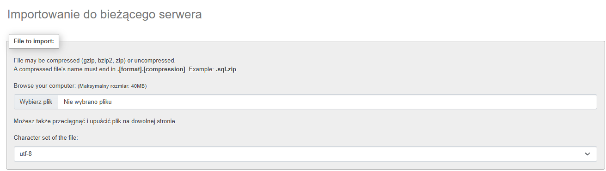

# Instrukcja obsługi aplikacji

## 1. Uruchomienie aplikacji

1. Do obsługi aplikacji używałem XAMPP'a.
2. W przypadku jeżeli korzystasz z XAMPP'a, skopiuj folder `webapp` do katalogu `htdocs` w XAMPP (`c:\xampp\htdocs\`).
3. Uruchom serwer Apache i MySQL w panelu XAMPP klikając START.
4. Zaimportuj bazę danych załaczoną w folderze `webapp` do XAMPP, poprzez kliknięcie przycisku admin w panelu XAMPP przy MySQL obok przyisku start/stop.
5. Ukaże się nam phpMyAdmin, z przycisków na górze wybieramy wybieramy SQL klikając na niego wpisujemy polecenie `create database webapp_db`, to utworzy nam naszą baze danych
6. Klikając w utworzoną bazę po lewej stronie, klikamy przycisk import z góry oraz wybieramy plik, który chcemy zaimportować (w naszym przypadku jest to `webapp_db.sql`)
7. Otwórz przeglądarkę i wpisz adres: http://localhost/webapp/public/assign.php --- Można również wykorzystać na końcu inne pliki takie jak `index.php`, `add_client.php` oraz `add_employee.php`.

## 2. Jak dodać klienta?

1. Przejdź do zakładki „Dodaj klienta” przyciskiem widocznym na górze strony lub otwórz plik `add_client.php`.
2. Wypełnij wszystkie pola formularza:

- Imię
- Nazwisko
- Nazwa firmy
- Numer telefonu (w tabeli jak i w bazie automatycznie przed dodaje się polski numer kierunkowy +48, więc maksymalnie można wpisać 9 liter)

3. Kliknij przycisk **Zapisz**.
4. Po poprawnym dodaniu pojawi się komunikat o sukcesie.

## 3. Jak dodać opiekuna?

1. Przejdź do zakładki „Dodaj opiekuna” przyciskiem widocznym na górze strony lub otwórz plik `add_employee.php`.
2. Wypełnij pola formularza imię oraz nazwisko.
3. Kliknij przycisk **Zapisz**.
4. Po poprawnym dodaniu pojawi się komunikat o sukcesie.

## 4. Jak przypisać opiekuna do klienta?

1. Przejdź do zakładki „Przypisz opiekuna” przyciskiem widocznym na górze strony lub otwórz plik `assign.php`.
2. Wybierz klienta z listy.
3. Wybierz opiekuna lub opiekunów z listy.
4. Kliknij przycisk **Przypisz**.
5. Po poprawnym przypisaniu pojawi się komunikat o sukcesie.

## 5. Uwagi

- Jeśli pojawią się błędy połączenia z bazą danych, sprawdź plik `config/db.php` i ustaw poprawne dane w moim przypadku jest to:
  $host   = '127.0.0.1';
  $db = 'webapp_db';
  $user = 'root';.
- W razie problemów z wyświetlaniem, odśwież stronę lub sprawdź czy poprawnie uruchomiono serwer.
